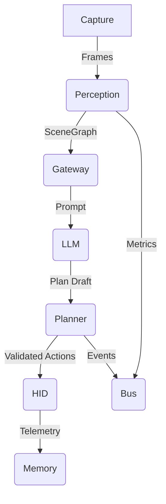

# JadeAI Architecture

JadeAI is built as a collection of loosely coupled microservices that exchange structured messages. The primary execution flow
is:

1. **Capture** frames from the external computer via HDMI capture.
2. **Perception** service runs detection and OCR on frames and builds a scene graph.
3. **Gateway** exposes the scene graph to the LLM and planner via gRPC/WebSocket.
4. **LLM** proposes a plan given the task and the current scene.
5. **Planner** validates the plan against safety policy and produces executable HID actions.
6. **HID** service executes the actions by emulating a keyboard/mouse.
7. **Memory** persists contextual data and transcripts for auditing.
8. **Bus** propagates events/metrics and enables streaming observability.

The services are intentionally small and can be deployed individually for experimentation. Communication uses JSON/MessagePack
payloads over HTTP or NATS.

## Data Flow

## Configuration

Configuration is centralised under `configs/` and read using environment variables with sensible defaults. Services only require
minimal state: the LLM reads from mounted model directories, the HID service needs access to `/dev/hidg*` or the Bluetooth
adapter.

## Local Development

- Use `make install` to create a local virtual environment with all dependencies.
- Start services individually using `uvicorn services.gateway.app.main:app --reload` etc.
- Run unit tests with `make test`.

## Extending the System

- Replace the perception detector by dropping new TensorRT engines in `data/cache/` and updating `configs/models.yml`.
- Integrate external tools (browser automation, CLI) via the planner's tool registry in `services/planner/planner.py`.
- Swap the LLM provider by editing `services/llm/server.py` and the `models.yml` config.
